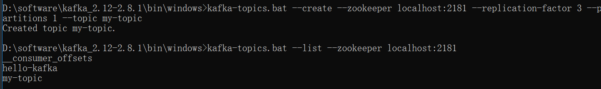

### Windows 10下搭建

#### 安装Zookeeper(注意安装目录不要有空格)

conf文件夹下zoo_sample.cfg修改为zoo.cfg

创建data文件夹并修改zoo_cfg中

```
dataDir=D:/software/apache-zookeeper-3.7.0-bin/data
dataLogDir=D:/software/apache-zookeeper-3.7.0-bin/log

audit.enable=true
// 默认端口2181
clientPort=2181
```

配置环境变量：略

命令行执行zkServer启动Zookeeper

#### 安装Kafka

下载地址：https://kafka.apache.org/downloads  （下载Bin格式，解压即用）

修改config文件夹下的server.properties中的

```
log.dirs=D:/software/kafka_2.12-3.0.0/log

// zookeeper连接配置 默认连接本机2181端口
zookeeper.connect=localhost:2181
```

启动Kafka(Kafka安装目录下打开命令行，执行以下命令)

```
.\bin\windows\kafka-server-start.bat .\config\server.properties
```


第一遍安装的是kafka_2.12-3.0.0，启动时会报错


由于Kafka对于Windows的文件系统支持的不好，所以使用低版本的kafka_2.12-2.8.1

#### 创建topic

```
kafka-topics.bat --create --zookeeper localhost:2181 --replication-factor 1 --partitions 1 --topic ${topic name}
```

```
// 查看topic
kafka-topics.bat --list --zookeeper localhost:2181
```

 

#### 启动生产者

```
kafka-console-producer.bat --broker-list localhost:9092 --topic ${topic name}
或
kafka-console-producer.bat --bootstrap-server localhost:9092 --topic ${topic name}
```

启动时出现如下错误

 

以上报错是由于server.properties中没有配置listeners，添加如下配置

 

重启Kafka，启动生产者成功


#### 启动消费者

```
kafka-console-consumer.bat --bootstrap-server localhost:9092 --topic ${topic name} [--from-beginning]
// 添加 --from-beginning 会重复消费之前的消息
```

这里有两个this is a message是我之前多写进去的


#### Java调用

##### 注意

引入maven依赖，以下二选一

```
        <!-- https://mvnrepository.com/artifact/org.apache.kafka/kafka-clients -->
        <dependency>
            <groupId>org.apache.kafka</groupId>
            <artifactId>kafka-clients</artifactId>
            <version>2.8.1</version>
        </dependency>
```

```
        <!-- https://mvnrepository.com/artifact/org.springframework.kafka/spring-kafka -->
        <dependency>
            <groupId>org.springframework.kafka</groupId>
            <artifactId>spring-kafka</artifactId>
            <version>2.8.0</version>
        </dependency>
```


 client端版本要和Kafka一致，第一遍使用的client端版本过低，报错如下

##### 生产者

```
public static String topic = "hello-kafka";//定义主题

    public static void main(String[] args) throws InterruptedException {
        Properties p = new Properties();
        p.put(ProducerConfig.BOOTSTRAP_SERVERS_CONFIG, "127.0.0.1:9092");//kafka地址，多个地址用逗号分割
        p.put(ProducerConfig.KEY_SERIALIZER_CLASS_CONFIG, StringSerializer.class);
        p.put(ProducerConfig.VALUE_SERIALIZER_CLASS_CONFIG, StringSerializer.class);
        KafkaProducer<String, String> kafkaProducer = new KafkaProducer<>(p);

        try {
            while (true) {
                String msg = "Hello," + new Random().nextInt(100);
                ProducerRecord<String, String> record = new ProducerRecord<String, String>(topic, msg);
                kafkaProducer.send(record);
                System.out.println("消息发送成功:" + msg);
                Thread.sleep(500);
            }
        } finally {
            kafkaProducer.close();
        }

    }
```

启动生产者，命令行中的消费者可以正常接收消息

 

##### 消费者

```
public static void main(String[] args) {
        Properties p = new Properties();
        p.put(ConsumerConfig.BOOTSTRAP_SERVERS_CONFIG, "127.0.0.1:9092");
        p.put(ConsumerConfig.KEY_DESERIALIZER_CLASS_CONFIG, StringDeserializer.class);
        p.put(ConsumerConfig.VALUE_DESERIALIZER_CLASS_CONFIG, StringDeserializer.class);
        p.put(ConsumerConfig.GROUP_ID_CONFIG, "test");

        KafkaConsumer<String, String> kafkaConsumer = new KafkaConsumer<String, String>(p);
        kafkaConsumer.subscribe(Collections.singletonList(Producer.topic));// 订阅消息

        while (true) {
            ConsumerRecords<String, String> records = kafkaConsumer.poll(100);
            for (ConsumerRecord<String, String> record : records) {
                System.out.println(String.format("topic:%s,offset:%d,消息:%s", //
                        record.topic(), record.offset(), record.value()));
            }
        }
    }
```

#### 搭建3节点集群

##### 准备配置文件

 

修改以下

server1.properties中

```
broker.id=1
listeners=PLAINTEXT://localhost:9093
log.dirs=D:/software/kafka_2.12-2.8.1/log1
```

server2.properties中

```
broker.id=2
listeners=PLAINTEXT://localhost:9094
log.dirs=D:/software/kafka_2.12-2.8.1/log2
```

启动两个节点


现在创建一个复制因子为3的新主题my-topic



在一个集群中，运行“describe topics”命令查看哪个broker正在做什么


注释：第一行给出了所有分区的摘要，每个附加行提供有关一个分区的信息。由于我们只有一个分区用于此主题，因此只有一行。

-  “leader”是负责给定分区的所有读取和写入的节点。每个节点将成为随机选择的分区部分的领导者。
-  “replicas”是复制此分区日志的节点列表，无论它们是否为领导者，或者即使它们当前处于活动状态。
-  “isr”是“同步”复制品的集合。这是副本列表的子集，该列表当前处于活跃状态并且已经被领导者捕获。

Java中kafka client连接集群：

```
p.put(ConsumerConfig.BOOTSTRAP_SERVERS_CONFIG, "127.0.0.1:9092,127.0.0.1:9093,127.0.0.1:9094");
```

启动后可以正常生产和消费

此时结束掉brokerid=2的节点，经过短暂的不可用后，又可以正常收发消息

 

 

describe查看my-topic，可以看到brokerId=0的节点成为了新的leader

